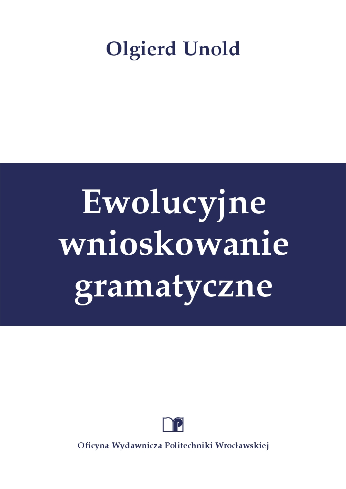

# Ewolucyjne wnioskowanie gramatyczne

## Roadmap
[Strona domowa]() | [Okładka](#okładka) | [Streszczenie](#streszczenie) | [Abstract](#abstract) | [Spis treści](#spis-treści) | [PDF](#pdf) | [Errata](#errata)

## Okładka

## Streszczenie
W monografii została podjęta ważna i płodna zarówno teoretycznie, jak i praktycznie tematyka wnioskowania gramatycznego (maszynowego uczenia gramatyk). Zaproponowano nowy model ewolucyjnego wnioskowania gramatycznego, którego zasadniczym przeznaczeniem jest indukcja gramatyki bezkontekstowej. Konstrukcja nowego modelu ewolucyjnego wykorzystuje mechanizm uczenia stosowany w uczących się systemach klasyfikujących. W modelu klasyfikatorami są produkcje gramatyki bezkontekstowej podane w postaci normalnej Chomskyego, natomiast otoczeniem, do którego adaptuje się system, jest zbiór uczący składający się z przykładowych zdań opatrzonych etykietą, określającą przynależność lub brak przynależności zdania do poszukiwanego języka. Celem uczenia jest poprawna klasyfikacja zdań uczących. Ponieważ zbiór klasyfikatorów tworzy zestaw produkcji gramatyki, to poprawna klasyfikacja etykietowanych zdań oznacza wyindukowanie poszukiwanej gramatyki języka. Model śledzi produkcje użyte podczas analizy zbioru uczącego i po jej zakończeniu oblicza funkcję dopasowania każdej produkcji. Nowe produkcje gramatyki są odkrywane podczas procesu indukcji przez mechanizm pokrycia oraz algorytm genetyczny. W pracy można wyodrębnić dwie części.

Pierwsza część pracy wprowadza w tematykę wnioskowania gramatycznego, ewolucyjnego przetwarzania oraz uczących się systemów klasyfikujących. W szczególności zaprezentowano aktualny stan badań w zakresie indukcji gramatyki bezkontekstowej,  nowy sposób kategoryzacji uczących się systemów klasyfikujących oraz ich podstawowe modele w jednolitym ujęciu.

W drugiej części pracy zaproponowano oryginalny model ewolucyjnego wnioskowania gramatycznego, dedykowany indukcji gramatyki bezkontekstowej. Architekturę i działanie nowego modelu opisano posługując się kategoriami uczącego się systemu klasyfikującego. Wprowadzono tzw. mechanizm płodności produkcji, który wraz z mechanizmem ścisku oraz operatorem genetycznym inwersji ma przeciwdziałać wysokiej epistazie populacji produkcji modelu. Zdefiniowano nowe operatory pokrycia dostosowane do zastosowanej metody parsowania oraz estymatory dokładności i kosztu indukcji. Przeprowadzono indukcję języków regularnych z tzw. zbioru Tomity, wybranych formalnych języków bezkontekstowych, a także obszernych korpusów językowych. Eksperymenty wykazały, że model uzyskuje dla każdej z badanych klas języka wyniki porównywalne z najlepszymi ze znanych w literaturze przedmiotu i to nie tylko wśród metod ewolucyjnych, a w wielu wypadkach lepsze. Przeprowadzono badania symulacyjne modelu, których celem było eksperymentalne stwierdzenie własności proponowanego modelu ewolucyjnego. Poza wnioskami szczegółowymi osiągnięto również interesujące wyniki dotyczące ogólnych mechanizmów ewolucyjnych, jak wpływ selekcji turniejowej i ścisku na nacisk selektywny, czy rola nowego operatora pokrycia pełnego w procesie ewolucji populacji uczącego się systemu klasyfikującego. Wskazano na jedno z możliwych praktycznych zastosowań modelu, poza badanym już w monografii obszarem inżynierii lingwistycznej, jakim jest genomika obliczeniowa. Rozpatrywano zadanie rozpoznawania sekwencji telomerowej u człowieka oraz poszukiwania regionu promotorowego u bakterii E. coli. Model w obecnej implementacji może być zastosowany na wysokim poziomie estymatora swoistości do rozpoznawania regionów nienależących do sekwencji promotorowych.

## Abstract
### EVOLUTIONARY GRAMMATICAL INFERENCE

The monograph takes up an important and prolific, both theoretically and practically, subject of grammatical inference (grammar induction). A new model of evolutionary grammatical inference has been proposed, and its main purpose is context-free grammar induction. The structure of the new evolutionary model utilizes a learning mechanism applied in learning classifier systems. Here the classifiers are productions of context-free grammar presented in the Chomsky normal form, and the environment to which the system adapts is a learning set composed of the exemplary sentences. These sentences are labeled to distinguish a collocation or lack thereof to the searched language. The purpose of learning is a correct classification of learning sentences. Since the set of classifiers constitutes a grammar production unit, the correct classification of labeled sentences denotes inducing a grammar. The model monitors the productions used during the learning set analysis and after the analysis calculates a fitness function of each production. New grammar productions are discovered during the induction by a covering and a genetic algorithm.

The thesis is divided into two parts. The first part introduces into the area of grammatical inference, evolutionary processing, and learning classifier systems. In particular, the state of the art in the research in context-free grammar induction has been presented, a new categorization method of learning classifier systems has been proposed, and their generic models have been introduced in a uniform depiction.

The second part proposes an original model of evolutionary grammatical inference, dedicated to context-free grammar induction. The architecture and operation of the new model have been described with the use of the categories of a learning classifier system. So called “production fertility mechanism” has been introduced, which together with a crowding mechanism and inversion operator is supposed to counteract the high epistasis in production population. New covering operators adapted to the applied parsing method and estimators of induction accuracy and cost have been defined. The conducted induction includes regular languages from the Tomita set, chosen formal context-free languages, and large natural language corpora. These experiments showed that for each class of the examined language the model obtains results which are comparable with, and in some cases even better than, the best known in the literature of the subject, and not only among the evolutionary methods. Computer simulations have been conducted to experimentally identify qualities of the proposed evolutionary model. In addition to detailed conclusions, interesting results concerning general evolutionary mechanisms have been obtained, including an influence of tournament selection and of crowding on selective pressure, or the role of a new full covering operator in the evolution process of the population of a learning classifier system. Except for the examined in this thesis area of linguistic engineering, one of the potential applications of the model has been pointed to, which is computational genomics. The issues of an identification of human telomer sequence and of searching for a E. coli promoter region have also been investigated. The model in its current implementation can be applied at a high level of the specificity estimator to recognize regions not belonging to promotor sequences.

## Spis treści

## PDF

## Errata
